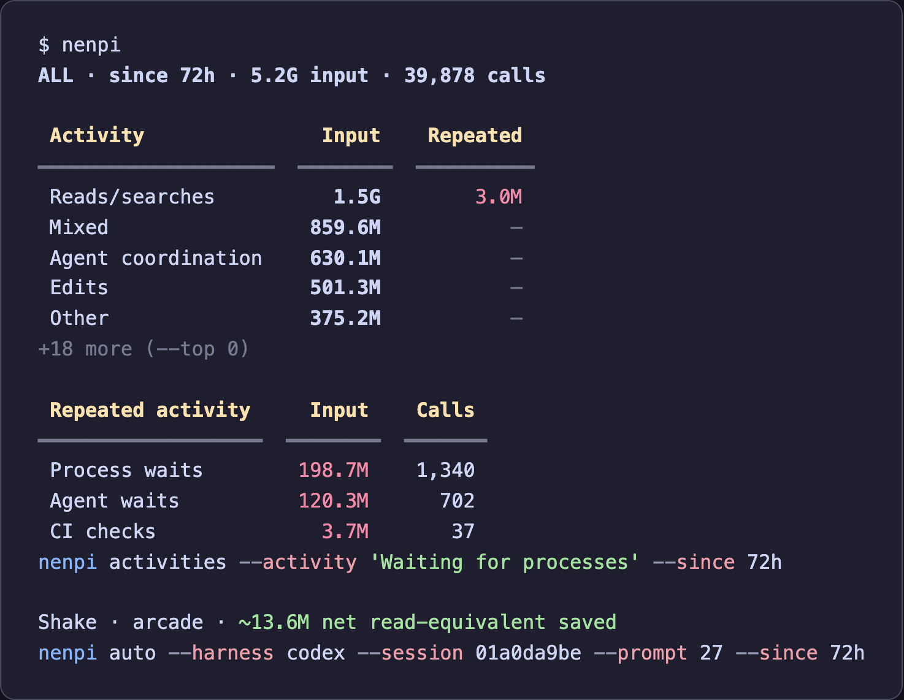

# nenpi

nenpi (燃費, fuel economy) shows where Claude Code and Codex CLI usage goes,
including repeated checks that keep sending a large context to the model.
It reads local transcripts. Requires Python 3.11+.



## Install

```sh
uv tool install 'nenpi[browser] @ git+https://github.com/epsalmond/nenpi'
```

## Basic usage

Run `nenpi` for activity usage and repeated input over the last 72 hours.
Follow the commands in the report to dig in.

```sh
nenpi
nenpi --since 7d
nenpi --project ~/project-dir
nenpi --exclude-project ~/project-dir
```

Inspect a session or activity:

```sh
nenpi sessions
nenpi auto --session SESSION_ID
nenpi activities --activity 'Waiting for CI'
```

Use `nenpi config` to inspect transcript sources, `nenpi-ui` for the terminal UI,
or `nenpi-web` for the browser UI. Add `--json` for structured reports.

## Guides

- [Usage and configuration](docs/usage.md): installation options, transcript roots, and UI.
- [Diagnostics](docs/diagnostics.md): activity breakdowns, filters, tools, and Shake savings.
- [Themes](docs/themes.md): colors and terminal output.
- [Quota measurement](docs/drain.md): commands and accounting details.
- [Benchmarks](docs/bench.md): measure and fit usage weights.
